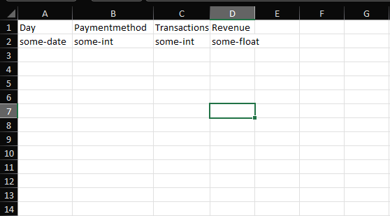

# Algorithm for fraud control
This algorithm is designed to detect deviations in the amount of transactions and the revenue for a given day. To do this, the normal distrubition is used to determine whether something is a deviation. The finished product is `Concept5`, and is used by default.

This was made for an assignment by [pay.nl](https://www.pay.nl/).

## Requirements

This project was built with PHP 8.1, but older versions may work as well

## Dataset

The dataset is not included due to privacy concerns.
Below is an instruction to create your own.



The algorithm runs all sheets present in the file.

## Running the algorithm

```php
$ composer install
```

Make sure you have your dataset in the project folder as `data.xlsx` before running the below command

```php
$ php index.php
```

After the process exits the Excel file can be opened to review the results.

